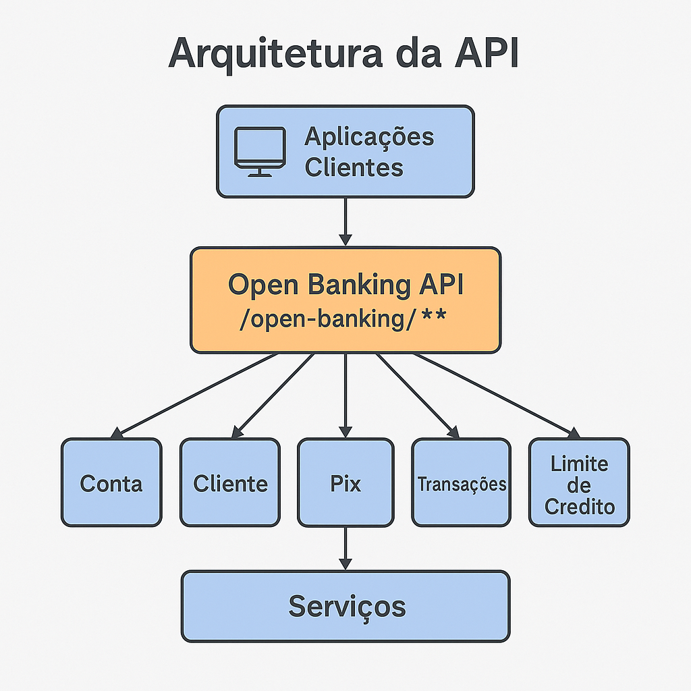

# Open Banking API (Demo)

Este projeto é uma simulação de uma API de Open Banking desenvolvida com **Java 17** e **Spring Boot**, seguindo a abordagem **API First** com especificação **OpenAPI 3.0**. A API demonstra operações típicas de Open Finance regulamentadas pelo Banco Central do Brasil, como consulta de saldo, extrato, dados do cliente, limite de crédito e transferência PIX.

---

## 📌 Visão Geral

A API simula a interoperabilidade entre instituições financeiras, permitindo:

- Consulta de saldo de contas bancárias
- Listagem de contas de um cliente
- Consulta de dados cadastrais do cliente
- Consulta de extrato (transações) da conta
- Realização de transferências via PIX (simulado)
- Consulta de limite de crédito pré-aprovado

---

## 🔍 Funcionalidades

| Endpoint | Método | Descrição |
| -------- | ------ | -------- |
| `/open-banking/contas/{contaId}/saldo` | GET | Consulta saldo da conta |
| `/open-banking/clientes/{clienteId}/dados` | GET | Retorna dados cadastrais do cliente |
| `/open-banking/clientes/{clienteId}/contas` | GET | Lista todas as contas do cliente |
| `/open-banking/contas/{contaId}/transacoes` | GET | Consulta extrato da conta |
| `/open-banking/pix/transferencias` | POST | Realiza uma simulação de transferência PIX |
| `/open-banking/clientes/{clienteId}/limite-credito` | GET | Consulta limite de crédito do cliente |

---

## 📷 Arquitetura da Solução



---

## 🛠️ Tecnologias Utilizadas

- **Java 17**
- **Spring Boot 3.x**
- **Spring Web**
- **Springdoc OpenAPI 2.x**
- **Maven**
- **Swagger UI**
- **Lombok**
- **H2 Database** (para simulação de persistência em memória)

---

## 🚀 Como executar o projeto

1. **Clone o repositório:**

```bash
git clone https://github.com/seu-usuario/openbankapi.git
cd openbankapi
